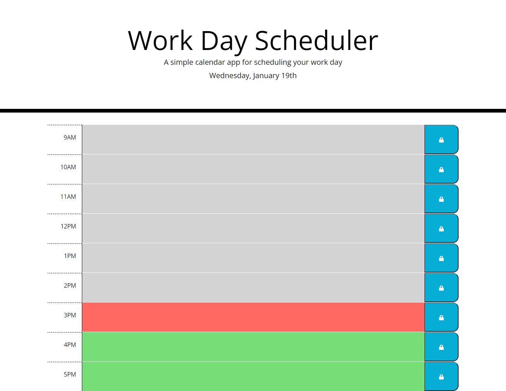

# Work Day Scheduler Starter Code

## Purpose
A  calendar that saves events for each hour of work day. This calendar app uses jQuery to dynamically update HTML and CSS.

## Built with 
* jQuery
* JavaScript
* HTML
* CSS

## Website
https://ajmarrocco.github.io/work-day-scheduler/

## Images with Descriptions

### Displays current day

 

### Present with time blocks for standard business hours

### Color coded for all in the past

### Color coded for all in the future

### Color coding for 3PM

### Inputs events in scheduler and persists after refresh page

### Stores in local storage

## Contribution
Made by Anthony Marrocco

### &copy; Anthony Marrocco